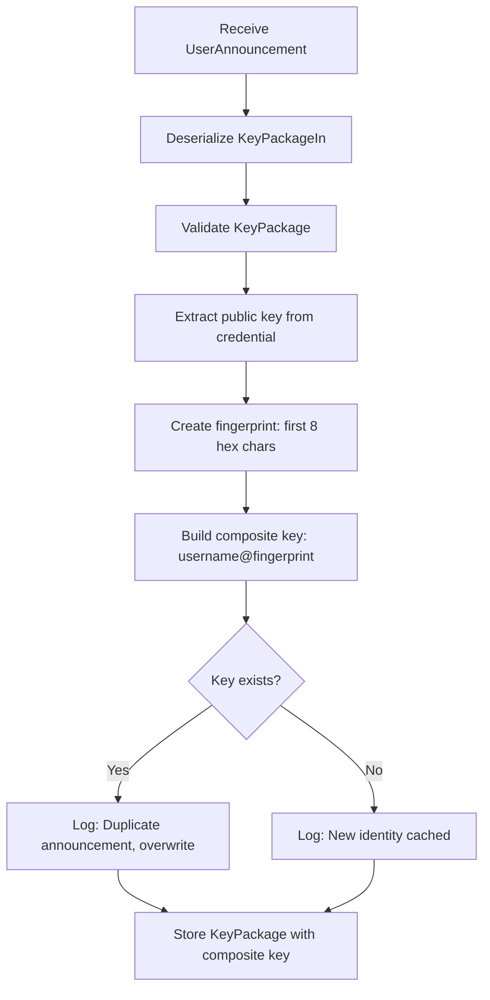

# Key Package Storage Architecture - Username Collision Fix

## Problem Statement

**Current Issue:** The `StateActor` stores key packages in a `HashMap<String, KeyPackageIn>` keyed by username (lines 221-222 in `src/state_actor.rs`):

```rust
self.key_packages
    .insert(user_announcement.username.clone(), key_package);
```

**Vulnerability:** If two users have the same username but different SSH keys (and thus different KeyPackages), the second user's KeyPackage will overwrite the first user's entry, causing:
- Loss of the first user's cryptographic material
- Inability to add the first user to groups
- Security implications if usernames are spoofed

## Solution: KeyPackageRef-Based Storage

### Overview

Use OpenMLS's built-in `KeyPackageRef` as the primary key. This is a cryptographic hash that uniquely identifies each KeyPackage, computed via the `hash_ref()` method.

### Architecture Design

#### Composite Key Approach

Use a **composite key** combining username with a short public key fingerprint to create a unique, human-readable identifier.

**Key Format:** `username@fingerprint`
- Example: `john@a1b2c3d4`, `alice@9f8e7d6c`

```rust
pub struct StateActor {
    // ... existing fields ...
    
    // Storage using composite key (username@fingerprint)
    key_packages: HashMap<String, KeyPackage>,
}
```

**Benefits:**
1. ✅ **Collision-Free**: Public key fingerprint ensures uniqueness
2. ✅ **Human-Readable**: Users can reference each other by visible identifiers
3. ✅ **No Ambiguity**: Each "john" has a different fingerprint
4. ✅ **Simpler**: Single HashMap, no secondary index needed
5. ✅ **Stable**: Fingerprint derived from public key (doesn't change)

**How it works:**
- Extract the Ed25519 public key from [`KeyPackage::credential()`](../../.cargo/registry/src/index.crates.io-1949cf8c6b5b557f/openmls-0.7.1/src/key_packages/key_package_in.rs:116)
- Create a short hex fingerprint (first 8 chars of hex-encoded public key)
- Composite key: `format!("{}@{}", username, fingerprint)`

### Data Flow



### Implementation Steps

#### 1. Add Helper Function for Fingerprint

**File:** `src/state_actor.rs`

Add a helper function to extract the public key fingerprint:

```rust
impl StateActor {
    /// Extract a short fingerprint from a KeyPackage's credential
    /// Returns the first 8 characters of the hex-encoded public key
    fn get_key_fingerprint(key_package: &KeyPackage) -> Result<String, StateActorError> {
        // Get the credential from the key package
        let credential_with_key = key_package.leaf_node().credential();
        
        // Extract the signature key (Ed25519 public key)
        let signature_key = key_package.leaf_node().signature_key();
        let public_key_bytes = signature_key.as_slice();
        
        // Create a short hex fingerprint (first 8 chars = 4 bytes)
        let fingerprint = hex::encode(&public_key_bytes[..4]);
        
        Ok(fingerprint)
    }
    
    /// Build a composite key from username and key package
    fn build_composite_key(
        username: &str,
        key_package: &KeyPackage,
    ) -> Result<String, StateActorError> {
        let fingerprint = Self::get_key_fingerprint(key_package)?;
        Ok(format!("{}@{}", username, fingerprint))
    }
}
```

#### 2. Update StateActor Structure

**File:** `src/state_actor.rs:19-26`

```rust
pub struct StateActor {
    groups: HashMap<String, MlsGroup>,
    active_group: Option<String>,
    identity_actor: ActorRef<IdentityActor>,
    mls_identity_actor: ActorRef<OpenMlsActor>,
    
    // Storage using composite key (username@fingerprint)
    key_packages: HashMap<String, KeyPackage>,
}
```

**Note:** `hex` crate needs to be added to `Cargo.toml` if not already present.

#### 3. Update UserAnnouncement Handling

**Location:** `src/state_actor.rs:200-225`

**Current Code:**
```rust
let key_package = KeyPackageIn::tls_deserialize(
    &mut &user_announcement.tls_serialized_key_package[..],
)?;

self.key_packages
    .insert(user_announcement.username.clone(), key_package);
```

**New Code:**
```rust
// Deserialize the KeyPackage
let key_package_in = KeyPackageIn::tls_deserialize(
    &mut &user_announcement.tls_serialized_key_package[..],
)?;

// Validate the KeyPackage
let key_package = key_package_in.validate(
    &openmls_rust_crypto::OpenMlsRustCrypto::default(),
    ProtocolVersion::default(), // or get from config
)?;

// Build composite key (username@fingerprint)
let composite_key = Self::build_composite_key(
    &user_announcement.username,
    &key_package,
)?;

// Check if this is a duplicate announcement
if self.key_packages.contains_key(&composite_key) {
    debug!(
        "Received duplicate announcement for: {} (overwriting)",
        composite_key
    );
} else {
    debug!(
        "Caching new KeyPackage for: {}",
        composite_key
    );
}

// Store with composite key
self.key_packages.insert(composite_key, key_package);
```

#### 4. Update StateActor Constructor

**Location:** `src/state_actor.rs:344-355`

No changes needed - the constructor remains the same since we're still using a single HashMap.

#### 5. Add Helper Methods

**New methods for StateActor:**

```rust
impl StateActor {
    /// Get a KeyPackage by composite key (username@fingerprint)
    pub fn get_key_package(&self, composite_key: &str) -> Option<&KeyPackage> {
        self.key_packages.get(composite_key)
    }
    
    /// List all composite keys matching a username prefix
    /// Example: list_keys_for_username("john") returns ["john@a1b2c3d4", "john@9f8e7d6c"]
    pub fn list_keys_for_username(&self, username: &str) -> Vec<String> {
        let prefix = format!("{}@", username);
        self.key_packages
            .keys()
            .filter(|key| key.starts_with(&prefix))
            .cloned()
            .collect()
    }
    
    /// Parse a composite key into username and fingerprint
    pub fn parse_composite_key(composite_key: &str) -> Result<(String, String), StateActorError> {
        let parts: Vec<&str> = composite_key.split('@').collect();
        if parts.len() != 2 {
            return Err(StateActorError::InvalidCompositeKey);
        }
        Ok((parts[0].to_string(), parts[1].to_string()))
    }
    
    /// Remove a KeyPackage by composite key
    pub fn remove_key_package(&mut self, composite_key: &str) -> Option<KeyPackage> {
        self.key_packages.remove(composite_key)
    }
}
```

#### 6. Update Error Handling

**File:** `src/error.rs`

Add new error variants:

```rust
#[derive(Debug, thiserror::Error)]
pub enum StateActorError {
    // ... existing errors ...
    
    #[error("Failed to validate KeyPackage")]
    KeyPackageValidationFailed(#[from] KeyPackageVerifyError),
    
    #[error("Invalid composite key format (expected username@fingerprint)")]
    InvalidCompositeKey,
    
    #[error("User not found")]
    UserNotFound,
}
```

#### 7. Future Group Member Addition

When implementing group member addition logic, use composite keys:

```rust
// Example: Adding a user to a group
pub fn add_member_to_group(
    &mut self,
    composite_key: &str,  // e.g., "john@a1b2c3d4"
) -> Result<(), StateActorError> {
    // Get the KeyPackage
    let key_package = self.get_key_package(composite_key)
        .ok_or(StateActorError::UserNotFound)?;
    
    // MLS group addition
    // let active_group = self.groups.get_mut(&self.active_group?)?;
    // active_group.add_members(&provider, &signer, &[key_package])?;
    
    Ok(())
}

// Helper: If user only knows username, show available identities
pub fn show_available_identities(&self, username: &str) -> Vec<String> {
    self.list_keys_for_username(username)
}
```

### User Experience Considerations

#### Composite Key Display

Users are identified by composite keys combining username and fingerprint:

1. **Listing Users:**
   ```
   Users in channel:
   - alice@a1b2c3d4
   - john@9f8e7d6c
   - john@4d3c2b1a  (different John with different key)
   ```

2. **Adding to Group:**
   ```bash
   # Simple case - single identity
   /add alice@a1b2c3d4
   
   # Multiple "john" identities - user picks the right one
   /add john@9f8e7d6c
   ```

3. **User Commands:**
   ```bash
   # List all identities for a username
   /whois john
   # Output:
   #   john@9f8e7d6c (Safety# 12345 67890 11121)
   #   john@4d3c2b1a (Safety# 98765 43210 55443)
   ```

4. **Logging:**
   ```
   [DEBUG] Caching new KeyPackage for: john@9f8e7d6c
   [DEBUG] Caching new KeyPackage for: john@4d3c2b1a
   [DEBUG] Received duplicate announcement for: alice@a1b2c3d4 (overwriting)
   ```

### Security Considerations

1. **Fingerprint Uniqueness**:
   - Using first 4 bytes (8 hex chars) of Ed25519 public key
   - Collision probability: ~1 in 4 billion (acceptable for small groups)
   - If collision occurs, second user overwrites first (detectable by safety number change)
   - For high-security: Consider using longer fingerprints (16+ chars)

2. **Validation Requirement**:
   - MUST validate KeyPackage before extracting fingerprint
   - Ensures signature verification and lifetime checks

3. **Identity Verification**:
   - Users should verify safety numbers before trusting communications
   - Composite key makes it clear when multiple "johns" exist

4. **Public Key Extraction**:
   - Fingerprint is derived from the signature key in the credential
   - This is the same Ed25519 public key from the user's SSH key
   - Stable across KeyPackage renewals (as long as SSH key doesn't change)

### Testing Strategy

#### Test Cases

1. **Single User, Single Identity** (baseline)
   - User announces with username "alice"
   - Verify stored as "alice@a1b2c3d4" (or similar fingerprint)
   - Verify retrievable by composite key

2. **Two Users, Same Username, Different Keys** (collision scenario)
   - User1 announces as "john" with SSH key A
   - User2 announces as "john" with SSH key B
   - Verify both stored: "john@9f8e7d6c" and "john@4d3c2b1a"
   - Verify both retrievable independently
   - Verify `list_keys_for_username("john")` returns both

3. **User Re-announces** (same key, same username)
   - User announces as "alice"
   - User re-announces as "alice" (same SSH key)
   - Verify composite key is identical (overwrites previous entry)
   - This is expected behavior - KeyPackage refresh

4. **Fingerprint Collision** (edge case)
   - Extremely unlikely with 8-char fingerprint
   - If occurs: second user overwrites first
   - Detectable: safety number would change for the composite key

5. **Helper Functions**
   - Test `list_keys_for_username()` with 0, 1, and multiple matches
   - Test `parse_composite_key()` with valid and invalid formats
   - Test `get_key_fingerprint()` extracts consistent fingerprints

### Migration Notes

**Breaking Change:** This changes the key format in `StateActor`.

**Old format:** `HashMap<String, KeyPackageIn>` keyed by username only
**New format:** `HashMap<String, KeyPackage>` keyed by `username@fingerprint`

If you have persistent storage:
- Existing entries keyed by username will not conflict with new composite keys
- However, old entries won't include fingerprints
- Recommendation: Clear cache and require users to re-announce
- Or: Add migration logic to recompute composite keys from stored KeyPackages

### Dependencies

**Required imports:**
```rust
use openmls::prelude::KeyPackage;
use openmls::key_packages::KeyPackageVerifyError;
use openmls::versions::ProtocolVersion;
```

**Required crate in Cargo.toml:**
```toml
hex = "0.4"  # For hex encoding of fingerprints
```

### References

- **OpenMLS Documentation**: KeyPackage credentials contain the identity
- **Implementation**: [`KeyPackageIn::unverified_credential()`](../../.cargo/registry/src/index.crates.io-1949cf8c6b5b557f/openmls-0.7.1/src/key_packages/key_package_in.rs:116)
- **Credential Structure**: BasicCredential contains the Ed25519 public key bytes
- **Your Code**: [`openmls_actor.rs:72`](src/openmls_actor.rs:72) shows how credentials are created from verifying keys

## Summary

**Key Insight:** Use a **composite key** combining username with a short public key fingerprint (`username@fingerprint`). This provides human-readable, unique identifiers without the complexity of dual-index systems.

**Trade-offs:**
- ✅ Solves collision problem completely
- ✅ Human-readable and user-friendly
- ✅ Simple single-HashMap architecture
- ✅ Stable across KeyPackage renewals (same SSH key = same fingerprint)
- ✅ No ambiguity when referencing users
- ⚠️ 8-char fingerprint has ~1 in 4 billion collision probability (acceptable)
- ⚠️ Users must use full composite key for commands (but can autocomplete)

**Advantages over KeyPackageRef approach:**
1. **Readable:** `john@9f8e7d6c` vs `KeyPackageRef([0x1a, 0x2b, 0x3c, ...])`
2. **Simpler:** Single HashMap vs dual-index system
3. **User-facing:** Can be shown in UI and used in commands directly

**Example UX:**
```bash
# List users
/users
> alice@a1b2c3d4
> john@9f8e7d6c
> john@4d3c2b1a

# Add to group
/add john@9f8e7d6c

# Check identity
/whois john
> john@9f8e7d6c (Safety# 12345 67890 11121)
> john@4d3c2b1a (Safety# 98765 43210 55443)
```

**Next Steps:** Switch to Code mode to implement these changes.